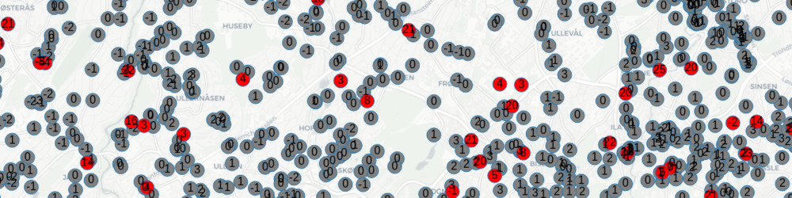

# Titanlib 
[](https://github.com/metno/titanlib/releases)
[](https://github.com/metno/titanlib/actions)

Titanlib is a library of automatic quality control routines for weather observations. It emphases spatial
checks and is suitable for use with dense observation networks, such as citizen weather observations. It is
written in C++ and has bindings for python and R. The library consists of a set of functions that perform
tests on data.

Titanlib is currently under active development and the current version is a prototype for testing. Feedback
is welcome, either by using the issue tracker in Github, or by contacting Thomas Nipen (thomasn@met.no).



## Documentation

For more information on how to use Titanlib, check out the wiki at https://github.com/metno/titanlib/wiki.

## Features

- A wide variety of spatial checks, such as **spatial consistency test**, **buddy check**, **isolation check**.
- Plausability tests such as **range check** and **climatology check**.
- A graphical interface for tuning the parameters of the checks
- Fast C++ implementation for efficient processing of large observation datasets 

## Required dependencies
- [Boost](https://www.boost.org/) >= 1.59
- [GNU Scientific Library](https://www.gnu.org/software/gsl/)

On Ubuntu Bionic, these can be installed like this:
```bash
sudo apt-get update
sudo apt-get install libboost-all-dev
sudo apt-get install libgsl-dev libblas-dev
```

## Installing the python bindings from pip

The easiest is to install the latest release of the package using pip. Provided you have installed the dependencies listed above, you can install the most recent release of the python package as follows:
```bash
pip3 install titanlib --user
```

To check that the installation worked, run the following in python3:
```python
import titanlib
print(titanlib.version())
```

## Full installation from source

1. Either download the source code from the [latest release](https://github.com/metno/titanlib/releases), unzip
   the file and navigate into the extracted folder; or clone the repo from github.

2. Install extra requirements

These are only required when installing from source
```
sudo apt install swig cmake
```

3. Set up cmake installation

```bash
mkdir build
cd build
cmake ..
```

4. Install the C++ library

```bash
sudo make install
```
This will install the library in `/usr/local/lib/libtitanlib.so`.

5. Install the python bindings

```bash
make install-python-user
```

This installs the python bindings in
`~/local/lib/python3.6/site-packages/titanlib.py`. To install the python bindings system-wide (or into whatever virtual environment you have loaded), use `sudo make install-python` instead.

6. Install the R bindings

```bash
make build-r
```

Currently, the R package is not installed centrally, but instead is placed in `swig/R/titanlib.R` in the build directory.

## Python example

Here is an example using the buddy check, which has the following function signature:
```python
buddy_check(points, values, radius, num_min, threshold, max_elev_diff, elev_gradient, min_std, num_iterations)
```

The test reveals that the last observation (-111) is likely faulty:

```python
import titanlib
flags = titanlib.buddy_check(titanlib.Points([60,60.1,60.2],[10,10,10],[0,0,0]),[0, 1, -111], [50000],[2],2,200,0,1,2)
print(flags)
```

```
[0 0 1]
```

## R example

Run the following code in R from the build directory, or if you want to run from any other directory, just
put in the proper paths for rtitanlib and titanlib.R

```
dyn.load(paste("extras/SWIG/R/titanlib", .Platform$dynlib.ext, sep=""))
source("extras/SWIG/R/titanlib.R")
cacheMetaData(1)

sct(c(60,60.1,60.2), c(10,10,10), c(0,0,0), c(0,1,-111),50000,2,2,100,0,1,2)
```

See also the _Installation tips and tricks_ on the [wiki](https://github.com/metno/titanlib/wiki/R-interface) .

## Copyright and license

Copyright © 2019-2022 Norwegian Meteorological Institute. Titanlib is licensed under The GNU Lesser General
Public License (LGPL). See LICENSE file.

## Contact

E-mail: Thomas Nipen (thomasn@met.no)
